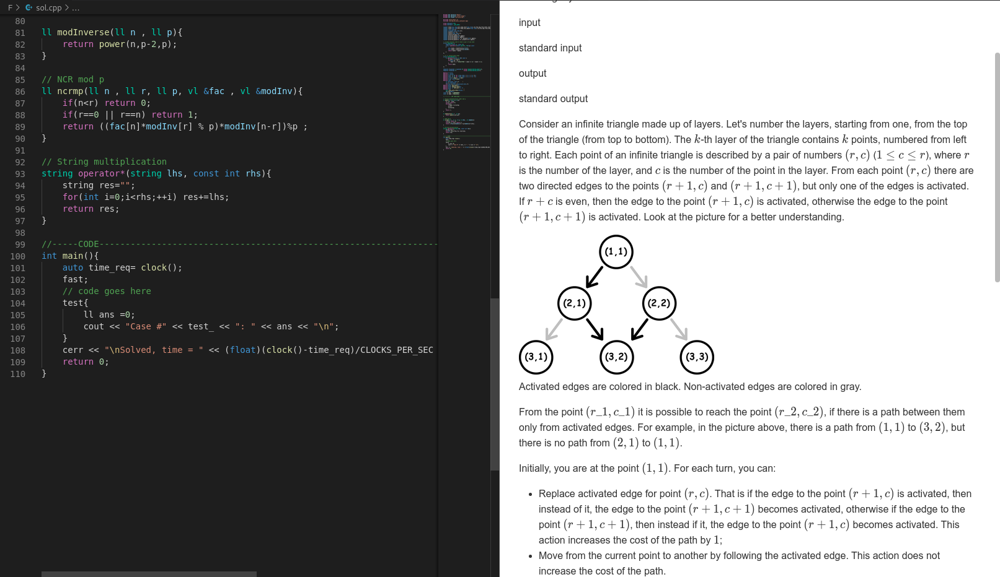

# vs-CoPPeR README

This is a VSCODE Extension aimed for boosting speed initializing files at start of Competitive Contests. Currently Supports Codeforces.

## Features

* Problem Statement Preview

* Problem Statement Preview (Dark Mode)

* Automatic File Generation based on contest
[File Generation Preview](preview_images/file_generation.png)
* Fully Customizable template code.
[cpp template](template.cpp)

> It is recommended to make a template from scratch as templates are generally personalized and will help in the learning process for competitive programming.

## Requirements

Use [markdown preview enhanced](https://marketplace.visualstudio.com/items?itemName=shd101wyy.markdown-preview-enhanced) for better rendering of the problem statement.

## Known Issues

Calling out known issues can help limit users opening duplicate issues against your extension.

-----------------------------------------------------------------------------------------------------------

## Working with Markdown

**Note:** You can author your README using Visual Studio Code.  Here are some useful editor keyboard shortcuts:

* Split the editor (`Cmd+\` on macOS or `Ctrl+\` on Windows and Linux)
* Toggle preview (`Shift+CMD+V` on macOS or `Shift+Ctrl+V` on Windows and Linux)
* Press `Ctrl+Space` (Windows, Linux) or `Cmd+Space` (macOS) to see a list of Markdown snippets

### For more information

* [Visual Studio Code's Markdown Support](http://code.visualstudio.com/docs/languages/markdown)
* [Markdown Syntax Reference](https://help.github.com/articles/markdown-basics/)

**Enjoy!**

-----------------------------------------------------------------------------------------------------------

## Developing
* Clone the Project.
* Run `npm install` in the terminal to install necessary dependencies.
* Press `F5` and run it with 'VS Code Extension Development'.
* `Ctrl+Shift+P` and search for 'Codeforces Cnt' and run it.
